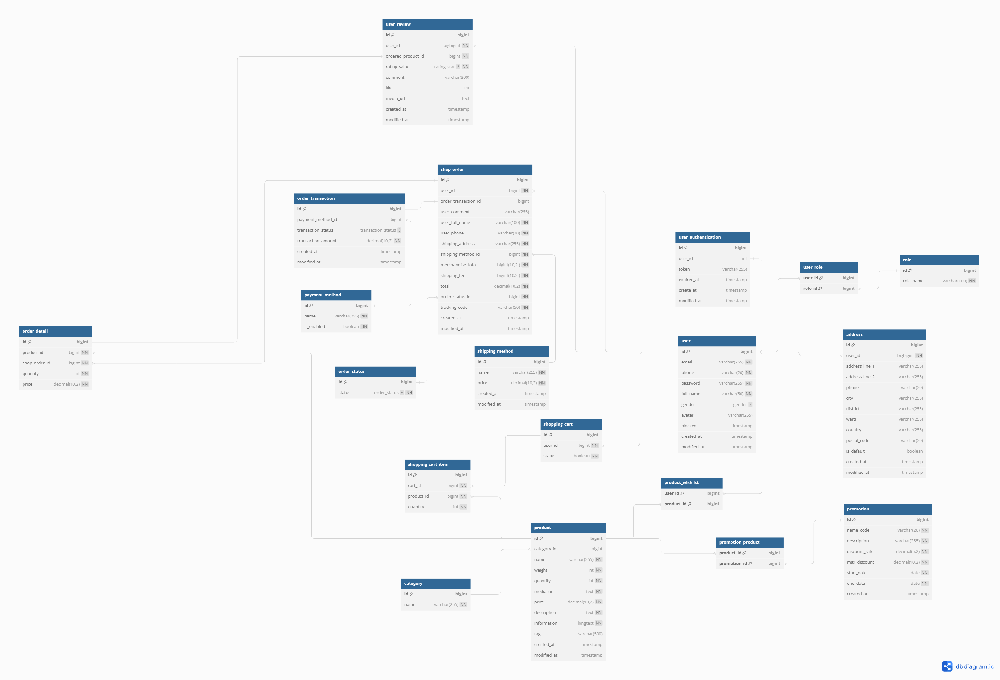

# REST API for an E-Commerce Application

**Author:** Ly Dai Phat (xiaojiudev)
**Email:** ldphat99@gmail.com
**Github:** [xiaojiudev](https://github.com/xiaojiudev)

I have developed this REST API for an-ecommerce application. This API performs all the fundamental CRUD operations of
any e-commerce platform with user validation at every step.

## 🚀 Project Overview

This project is developed by me during my project (CT466: Specialized Topics) in Can Tho University, VietNam.

## 🛰️ Key Components

### 📃 E-R Diagram

### 🛠️ Technology Stack

The API leverages a modern technology stack to deliver a powerful and secure e-commerce solution:

- Java
- Spring Framework
- Spring Boot
- Spring Security
- Spring Data JPA
- Spring Docs (Swagger)
- Hibernate
- MySQL
- Cloudinary (Cloud Service)

## 📦 Modules

- **Register, Login, Logout Module**
- **User module**
- **Product module**
- **Cart module**
- **Order module**

## 🚀 Features

### 🔒 Security

- Grant user authority upon registration.
- User authentication & validation with JWT (json web token) with a 30-minute validity for enhanced security.
- Securing REST API endpoints based on user role (CUSTOMER, MANAGER, ADMIN).

### 🏠 Address

- Create, read, update, and delete addresses.

### 🛍️ Product

- Retrieve product information for all users.
- Create, update, and delete products, with these actions restricted to MANAGER or ADMIN users.

### 🛒 Cart

- Create, manage, and maintain user shopping carts.
- Add, update, or remove products from a user's cart.

### 📦 Category

- Create, read, update, and delete product categories.

### 💳 Payment method

- Manage payment methods, including creation, retrieval, updating, and deletion.

### 📈 Order status

- Administer order status settings, covering creation, retrieval, updating, and deletion.

### 🚚 Shipping method

- Control shipping methods by creating, retrieving, updating, or deleting them.

### 📋 Order

- Place orders for products.
- Calculate merchandise fees, shipping fees, and total order costs.
- Retrieve detailed order information.

### ☁️ Storage

- Utilize the Cloudinary service for efficient storage of images, videos, and more.

## API Module Endpoints
